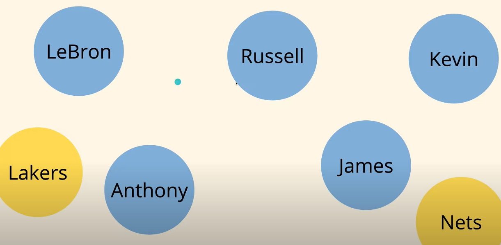
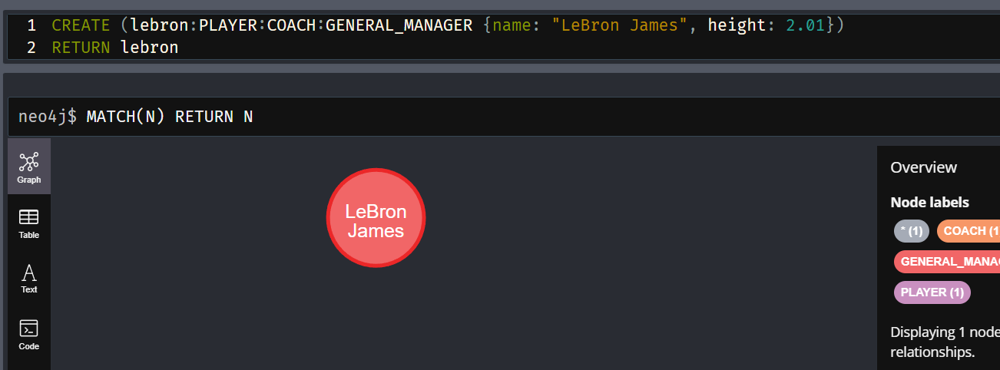
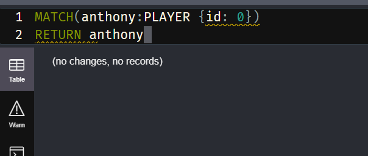
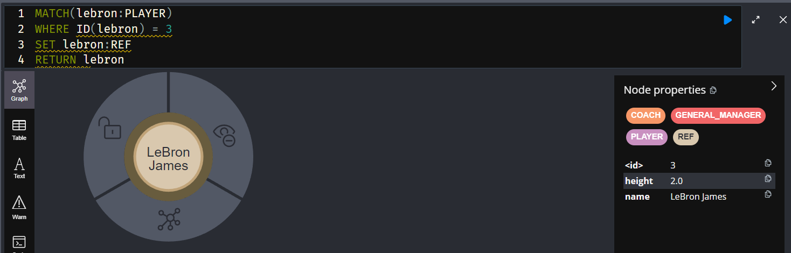

`1. Neo4j`

- Neo4j is an extremely popular `graph database`. 
- Database is somewhere where we are going to store our applications data.
- For eg. - let's say twitter is our application and we need a place to store the tweets, pictures & the accounts and of course we're gonna do that inside of a database. We're also going to create, retrieve, update or delete from our database.

- Now There are multiple database like for postgree's we have SQL, document databases like MongoDB or dynamoDB And key-value pair databases like Redis.

 

- `So why we need graph databases in the first place ????`
- We use graph Database when ourr application has a lot of relationships and twitter is a good example. So, people can write tweet and then people can react, comment or share it. so we have a relationship between the user that liked that tweet and that tweet and also that tweet belongs to a specific account so we have that relationship as well.

- 

 

`2. Working`

- Inside graph databases data is stored inside something called `node` and we can store anything in that node. It can be anything like a food item, name, age etc.

  - For eg. we can store a NBA player:

    - 

  - For multiple player it will be:

    - 

  - We can some other unrelated data too like team names:

    - 

  - Now we can make relationship among them like this:

    - 

- These relationships are `one directional`

  - 

 

- Now this looks a lot like `Graph Data Structure`

- `NOW ONE QUESTION` - `How do we know that it's lebron james???`
- We can do is put some `properties` inside it.

  - 

- `ANOTHER QUESTION` - `How do we distinguish which is a PLAYER and which is a TEAM????`
- We can give each node a `label` 
- So in order to separate our nodes because they might be different `entities`

  - 
  
- `RELATIONSHIPS`: We can create a relationship between nodes like a player and a team and these relationships `can also have properties`.

  - 

  

`3. Queries`

- 

- 

- 

  

- Now we'll put some dummy data to work upon using this link https://github.com/harblaith7/Neo4j-Crash-Course/blob/main/01-initial-data.cypher

  - 

- Now these queries are written using `Cypher Query Language`. Just like `Postgree uses SQL`

  - 

  

`3. Querying for nodes`

- `MATCH`: This is keyword we use to query for things. After that `()` add these paranthesis and inside this make a variable of any name which will represent nodes in the DB. After that we have to return this node.

  - 

  - 

   

  - To get Specific player or team list, we can use `:` after the variable in the bracket

    - 

  - To get Specific player's property we'll just access and return that property by using `.`. For eg. `match(n:PLAYER) return n.name`

    - 

    - 

    - 

  

`4. Filtering for Nodes`

- Now suppose we just want to fetch only one NODE. For eg. we want to get `Lebron James` Node.
- In order to achieve this, we just need to add `where` condition in between `match` and `return`.
  - 

- `NOTE:` Now there is one 

- Now, there is an another way to achieve this. We can get rid of where statement and use the `first bracket node` i.e.:
  - We can use key value pairs inside that node like `{name: "LeBron James"}`.
  - 
    

  - We can add multiple properties inside the node like we `name`, `age`, `height` etc.
  - 
    

- Now we want to fetch players whose name is not `LeBron James`.
  - We can do this by using the `where` statement:
  - 
    

-  Now we want to fetch players whose `age is greater than 25`.
  - 
    
  
- Now an interesting case, HOW can we get player's who has `BMI > 25`.
  - `NOTE:` BMI = weight/height^2
  - 
    

- Now we want to use two where statements together.
  - Using `AND` between where statements to get results(players) matching both of them
  - 
    

  - Using `OR` clause to get results matching either of them.
  - 
    

- We can use `LIMIT` to add like limit to the number of items in the final result. (like `pagination`).
  - 
    

  - Now using the `LIMIT` we're getting the players in a certain order. Now we want to skip the `1st two player` and show the next 2.
    - For This we can use `SKIP`.
  - 
    

- Now we want to get result in certain `order`.
  - And to do that we need to use `ORDER BY DESC/ASC`.
  - 
    
  
- `NOTE:` We cannot see the order of results in `graph view`. So, that's why we have to use `table` or `text` view to see.
  

- `***` Now we want to `filter multiple nodes at the same time`.
  - We can do this by adding another `set of nodes`.
  - In this example, there are `players` & `coaches`. So, there will be multiple nodes needed.
  - 
     

`5. Querying for Relationships`

- We'll query nodes based on their relationships
- For eg. we want to query all of the players that play for `LA Lakers`:
  - Now there are no property stored inside the node that will tell us about which team they are playing for.
  - So, we have get the result by using the `relationships`.
  - Now we need to get all players playing for a specific team:
    - `MATCH (player:PLAYER) -[]-> (team:TEAM)`
  - As we can see this can be achieved by using `arrows` - `-[]->` AND inside this bracket we can specify which relationship we want by using `:`.
    - `MATCH (player:PLAYER) -[:PLAY_FOR]-> (team:TEAM) WHERE team.name = 'LA Lakers' RETURN player`.
  - 
  - 
    

- There can be complex queries like adding more teams:
  - 
     

- As we know nodes have properties and these properties helps us to distinguish between different nodes.
- `Relationship also have properties` like in our case `PLAYS_FOR` has `salary` property.
  - 
    
- Now we can query for all players who have salary more than 35 million dollors.
  - We can actually name our relationship also like in this case `contract`.
  - `MATCH(player:PLAYER) -[contract:PLAYS_FOR]-> (:TEAM) WHERE contract.salary > 35000000 RETURN player`
  - As we can see that `team` name is not needed as we are not returning them.
  - 
    

- `*** IMP` We want to get only the teammates of `lebron James` whose salary is > 40000000.
  - First of all we'll get all of the players who are teammate of `lebron James`.
    - 
    
  
  - Now, in order to get the salary which is existing inside the relationship of `player and the team node`.
  - So, we'll have to get the `team` by using `another MATCH`

  - 

   

`6. Aggregating Data`

- Aggregating multiple datasets into one value.
- Now For Example: We need to find the number of games that a specific player has played. Now there are multiple relationships that determine each game.
  - The relationship `PLAYED_AGAINST` tells us about the game.
  - Now as we can see in the picture that we are `aggregating total number if games played`.
  - 
    

  - Now there are certain properties of this `PLAYED_AGAINST` relationship too that we can aggregate.
  - 
    

  - Now in order to get who scored the highest points.
  - 
    

`7. Delete Nodes and Relationships`

- In order to delete a node, `first we need to find it`.
- BUT.... there's one catch:
  - Suppose I want to delete `Ja Morant` node.
  - w.r.t. image below, this will give us an error that it still has relationships.
  - 
    

  - Now, in order to delete it with all of it's relationships we have to use `DETACH` before DELETE keyword.
  - 
    

- Now, suppose we want to `delete a relationship`.
  - So, we have to find that relationship and delete that.
  - 
    

- Now, `deleting every single node`.
  - 
   

`8. Creating Nodes and Relationships`

- `CREATE` keyword is used to create nodes.
- We can add `multiple labels` when we try to add nodes. Also there are properties for a node.
  - For example: `CREATE (lebron:PLAYER:COACH:GENERAL_MANAGER {name: "LeBron James", height: 2.01}) RETURN lebron`
  - 
    

- Now, we'll `create a node AS WELL AS a relationship`
  - For example: `CREATE (:PLAYER {name: "Anthony Davis"}) -[:PLAYS_FOR {salary: 36000000}]-> (:TEAM {name: "LA Lakers"})`
  - 
    

  - Now as we can see `LeBron James` node is not having any relationship, so we'll create one.
  - `MATCH(lebron:PLAYER {name: "LeBron James"}), (lakers:TEAM {name: "LA Lakers"}) CREATE (lebron) -[:PLAYS_FOR {salary: 40000000}]-> (lakers)`
  - 
    

- Now, if we wanted to update the name of one of the nodes then we'll use `id` for it.
  - But by doing this way it doesn't work:
  - 
    

  - So this case is only for using `id` to update a node.
  - First we see how to fetch the node using the `id`.
  -  
    
  - Now we'll see how to set/change the value of a property of the node.
  - We'll use `SET` keyword for that.
  - 
    

  - `Another Example:`
  - 
   

- We can also `update the labels`
  - 
   

- Now we want to update the salary in the relationship:
  - 

   

`9. Remove Nodes`
- We can remove a property of the node by using `REMOVE` keyword in the cypher query.
  - 